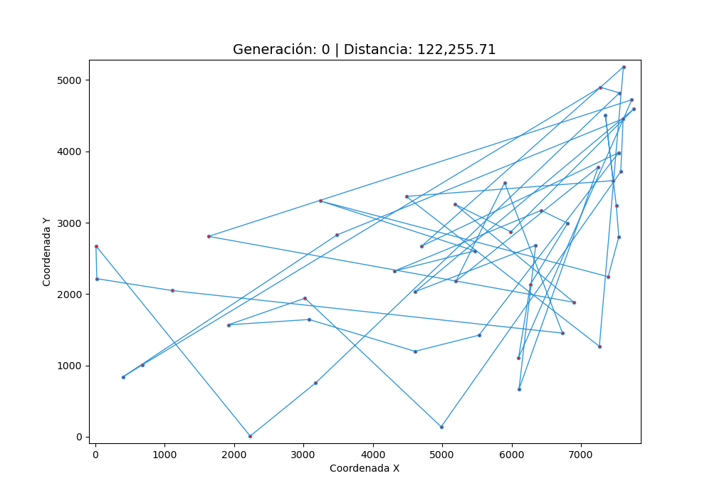
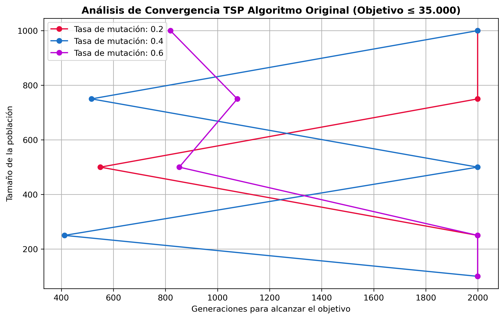
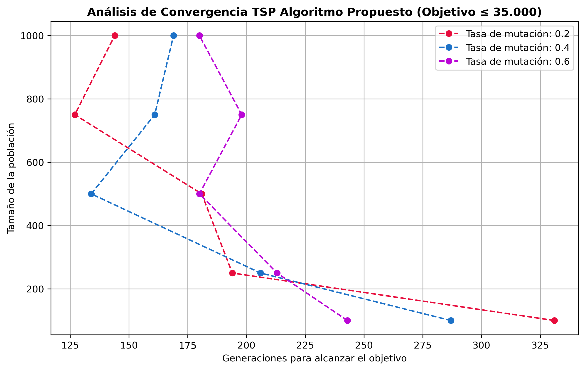
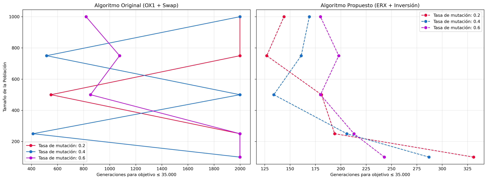

# 🧬 TSP Resolution using Genetic Algorithms


## Introduction

This project addresses the **Traveling Salesperson Problem (TSP)** by applying **Evolutionary Computation** techniques. The goal is to find an efficient route connecting 48 cities, minimizing the total distance traveled through the simulation of genetic algorithms, recreating biological operations such as: selection, crossover, and mutation.

### Objective of the Study

Analyze the parametric behavior of the algorithm against a dataset of 48 cities and their coordinates, aiming to reach an **optimal solution (distance ≤ 35,000.00)**.

---

## Experiment Setup

The execution has been structured in functional blocks within a **Jupyter Notebook** environment, facilitating direct tuning of the following hyperparameters:

| Parameter | Description |
| --- | --- |
| `population_size` | Number of individuals (routes) in each generation. |
| `num_generations` | Maximum iteration limit of the evolutionary process. |
| `mutation_rate` | Probability of genetic alteration to maintain diversity. |
| **Stopping Criterion** | Total distance $\le 35,000.00$ or generation limit. |

---

## Parametric Study

In this section, we will analyze the convergence of the original genetic algorithm by varying the **population size** `[100, 250, 500, 750, 1000]` and the **mutation rate** `[0.2, 0.4, 0.6]`.

The original algorithm consists of a crossover function and a mutation function that we will try to improve later, but let's first look at how the ones already defined work:

* **Order 1 Crossover (OX1):** Works as a "copy and paste". We randomly choose a segment of the route from the first parent (parent1), copy it into the offspring, and fill the rest with the genome of the second parent (parent2) following its order. In this case, a **toroidal logic** is followed, meaning we treat the genome as an infinite ring, since after all it represents a route (this helps prevent losing the sequence of the cities).
* **Swap Mutation:** Also known as exchange mutation, and for being one of the simplest forms of recombination in the field of evolutionary computation. But how does it work? We choose two random alleles from the offspring's genome, or what is the same, two random cities from the route, and swap them.

### Operation Visualization

#### Visualization Configuration
<div align="center">

| Parameter | Value |
| --- | --- |
| **Initial Population** | `100 individuals` |
| **Mutation Rate** | `0.2` |
| **Generation Limit** | `2000` |
| **Stopping Condition** | `≤ 35,000` |

</div>

Below is the evolution of the original algorithm (OX1 + Swap) on the dataset of 48 cities. The difficulty of the algorithm to optimize the route is observed. The system maintains numerous unnecessary intersections and displays erratic behavior, reaching 2000 generations without discovering a route that we consider optimal.

<div align="center">
  
</div>

> If you prefer to view it in high definition, you can download the original video file here: [Download MP4 Video](https://github.com/javierruanohdez/tsp-genetic-algorithm/raw/refs/heads/main/results/original_algorithm_tsp_evolution.mp4)

### Convergence Analysis


**Key observations:**

1. **Stochastic Nature:** The graph reveals a **non-linear** and **highly volatile** behavior, where the original algorithm (OX1 + Swap) shows a critical dependence on chance. A smooth progression is not observed, but rather abrupt crossovers between different mutation rates. This suggests that the algorithm easily falls into **local optima**, from which it does not always manage to escape before the generation limit (2000).

2. **The "Beneficial Chaos" of High Mutation:** Surprisingly, **Rate 0.6 (Purple)** is the one that manages to converge in the most scenarios (3 out of 5).
* **Interpretation:** In such a broad search space (48 cities), a low mutation (0.2) can make the algorithm overly "conservative," remaining trapped in suboptimal routes. Conversely, a 60% mutation introduces enough noise to escape those terrible solutions, even if the process is erratic. It is essentially a random search that compensates for the shortcomings of the OX1 operator.


3. **Sensitivity to Population Size:**
* **The wall of 2000 generations:** The fact that several configurations (including large populations) collide against this limit confirms that random exchange recombination (Swap) is insufficient to optimize routes of 48 cities, unlike when there were only 5 of them. A good simile would be that swapping only two cities is like trying to solve a Rubik's Cube by moving pieces at random: it works by pure probability.

---

## Improvement Proposal

After analyzing the instability of the original algorithm, we propose a transition from an approach based on **ordering** to one based on **adjacency**. In the TSP, the quality of a route does not depend on whether a city is third or fourth in said route, but what truly matters is who its neighbors (or edges) are.

### 1. Edge Recombination Crossover

The **ERX** operator focuses exclusively on preserving the connections (edges) present in the parents, being the standard for problems where adjacency is critical.

* **Algorithm Mechanics:**
1. **Edge Table:** An adjacency list $N(v)$ is built for each city $v$, gathering all the neighbors it has in both parents.
2. **Smart Selection:** An initial city is chosen. For the subsequent ones, the algorithm does not pick at random, but searches in $N(c)$ for the city $u$ with the **fewest remaining edges** (minimum $\vert{}N(u)\vert{}$).
3. **Constraint Management:** By prioritizing nodes with fewer options (more constrained nodes), ERX minimizes the need to introduce random edges ("dead-ends"), allowing the offspring to inherit between **95% and 99%** of its parents' edges.


### 2. Inversion Mutation

We replace *Swap* with **Inversion Mutation**, a much more subtle and efficient operator for routing problems.

* **How it works:** Two random cut points are selected and the subsegment between them is inverted.
* **Competitive Advantage:** While *Swap* breaks up to 4 adjacency connections, **Inversion only breaks 2**. This allows exploring new routes without massively destroying the solution structure that the crossover took generations to build.

---

### Justification for the Improvement

We believe that this combination will significantly outperform the original algorithm for three fundamental reasons:

1. **Preservation of Inheritance:** The original algorithm (OX1) is excellent for preserving relative order, but the TSP is a problem of **distances between adjacent nodes**. ERX is mathematically designed not to lose those valuable connections.
2. **Reduction of Stochastic Noise:** The instability observed in the previous analysis was due to the *Swap* mutation being overly destructive. **Inversion** acts as a smarter "local search", allowing the optimization of route segments without disrupting the rest.
3. **Evasion of Local Optima:** By using the **Edge Table**, the algorithm has a much clearer "roadmap" of which connections are promising, drastically reducing dependence on chance and preventing the system from getting stuck in the suboptimal solutions seen previously.

---

### Operation Visualization

#### Visualization Configuration
<div align="center">

| Parameter | Value |
| --- | --- |
| **Initial Population** | `100 individuals` |
| **Mutation Rate** | `0.2` |
| **Generation Limit** | `2000` |
| **Stopping Condition** | `≤ 35,000` |

</div>


Below is the evolution of the proposed algorithm (ERX + Inversion) on the dataset of 48 cities. It shows how the system efficiently "untangles" the route, eliminating unnecessary intersections in a few generations.
<div align="center">
  
</div>

> If you prefer to view it in high definition, you can download the original video file here: [Download MP4 Video](https://github.com/javierruanohdez/tsp-genetic-algorithm/raw/refs/heads/main/results/proposed_algorithm_tsp_evolution.mp4)

---

### Convergence Analysis


**Key observations:**

1. **Deterministic Efficiency:** Unlike the chaos of the original algorithm, the graph of the proposed model shows a **clustered and predictable convergence**. The algorithm no longer "hits" the 2000 generation limit; in fact, it reaches the fitness goal within a range of **125 to 330 generations**. This represents a performance improvement between **600% and 1000%** compared to the baseline method.
2. **The Triumph of Adjacency Inheritance (ERX):**
* **Interpretation:** The key to success lies in the fact that **ERX** does not shuffle positions, but rather builds the route based on real physical connections. By inheriting efficient routes instead of indices in a list, the algorithm maintains its geographic structure, avoiding the random jumps that ruined fitness in the OX1 model.


3. **Independence from Critical Mass and Noise:**
* **Stability in Mutation:** Here, low mutation rates (**0.2 Red** and **0.4 Blue**) become competitive again and even superior in high-population scenarios. We no longer depend on a 60% mutation rate to "escape" errors, because **inversion mutation** acts as an optimizer that naturally untangles the route.
* **Scalability:** Even with a minimal population of **100 individuals**, the proposed algorithm is capable of finding the solution in fewer than 350 generations, something the original algorithm could not achieve even with 1000 individuals and 2000 attempts. This demonstrates that the "intelligence" of the crossover operator is more powerful than the brute force of population size.

---

## Conclusions


When observing both panels side by side, the conclusion is immediate: the proposed algorithm (ERX + Inversion) is a major improvement over the original (OX1 + Swap).

### 1. Shift in the Convergence Area

* **Left Panel (Baseline):** The bulk of the results gathers on the far right (generations 800 to 2000). It is an algorithm that survives the time limit, but does not master the problem.
* **Right Panel (Proposal):** The success area has shifted drastically to the left (generations 125 to 330). What used to be an exceptional success case for the original algorithm is now the minimum standard of our proposal.

### 2. Solution Stability

* **Chaos:** In the original graph, the lines zigzag uncontrollably. This indicates that success is **sensitive to chance**. The same population size can take 400 or 2000 generations depending on luck.
* **Robustness:** In the proposal, the lines are much more vertical and predictable. This demonstrates that the algorithm is **robust**, meaning performance is consistent regardless of fluctuations in the mutation rate, indicating higher quality genetic inheritance.

### 3. Efficiency Ratio

* **Speedup Factor:** The proposal reaches the same fitness goal up to **10 times faster** in the best cases.
* **Resource Efficiency:** While the baseline algorithm requires massive populations (1000+) to attempt convergence, ERX with Inversion is capable of solving the problem optimally with populations **90% smaller** (100 individuals), saving critical computing time.

---

> The use of an **Adjacency Table (ERX)** to preserve edges and an **Inversion Mutation** to optimize geometry has transformed an inefficient stochastic process into a logistics optimization tool.

---

### Execution Instructions

```bash
# Clone the repository
git clone https://github.com/javierruanohdez/tsp-genetic-algorithm.git  tsp_genetic_algorithm
cd tsp_genetic_algorithm

# Create a virtual environment (Recommended)
python -m venv venv

# Activate the environment
## On Windows:
venv\Scripts\activate or .\venv\Scripts\Activate.ps1

## On Linux and macOS:
source venv/bin/activate

# Install dependencies
pip install -r requirements.txt

# Run the study
jupyter notebook TSP.ipynb
jupyter notebook TSP_monitor.ipynb

```

---

### Bibliographic Resources

For the development of this project and the implementation of advanced genetic operators, the following technical sources were consulted:

* **[Edge Recombination Crossover (ERX)](https://k78ma.github.io/quartz/4B/ECE-457A/Edge-Recombination-Crossover):** Resource used for the pseudocode approach and adjacency logic of the proposed improvement algorithm.

---
